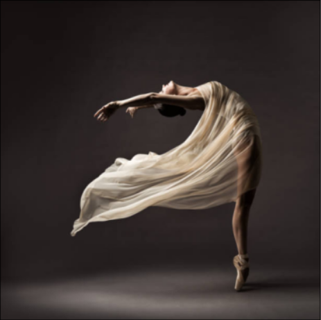

# 1. Overview
This project implements [Neural Algorithm of Artistic Style](https://arxiv.org/abs/1508.06576) using pytorch framework according to [this](https://pytorch.org/tutorials/advanced/neural_style_tutorial.html) guide and wraps it into telegram bot. The algorithm takes two images and generates a new image with content like the first image and style like the second.

There are several examples of how the algorithm works.

| Content Image | Style Image | Result |
| :--: | :--: | ---- |
|  |  |  |
|  |  |  |

# 2. Installation
## Prerequisites
- docker engine / docker desktop
- git

## Installation for CPU oriented model
1. In terminal write: git clone https://github.com/stapin/style-transfer-bot.git
2. Change TG_BOT_TOKEN env variable in Dockerfile to your telegram bot token gotten form BotFather
3. Run in the root of the project this commands: 
	1. docker build -t style_transfer_app .
	2. docker run --rm -d style_transfer_app

## Installation for GPU oriented model
***coming soon...***

